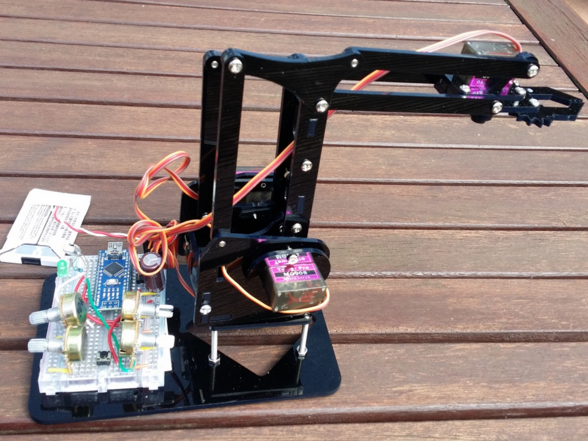
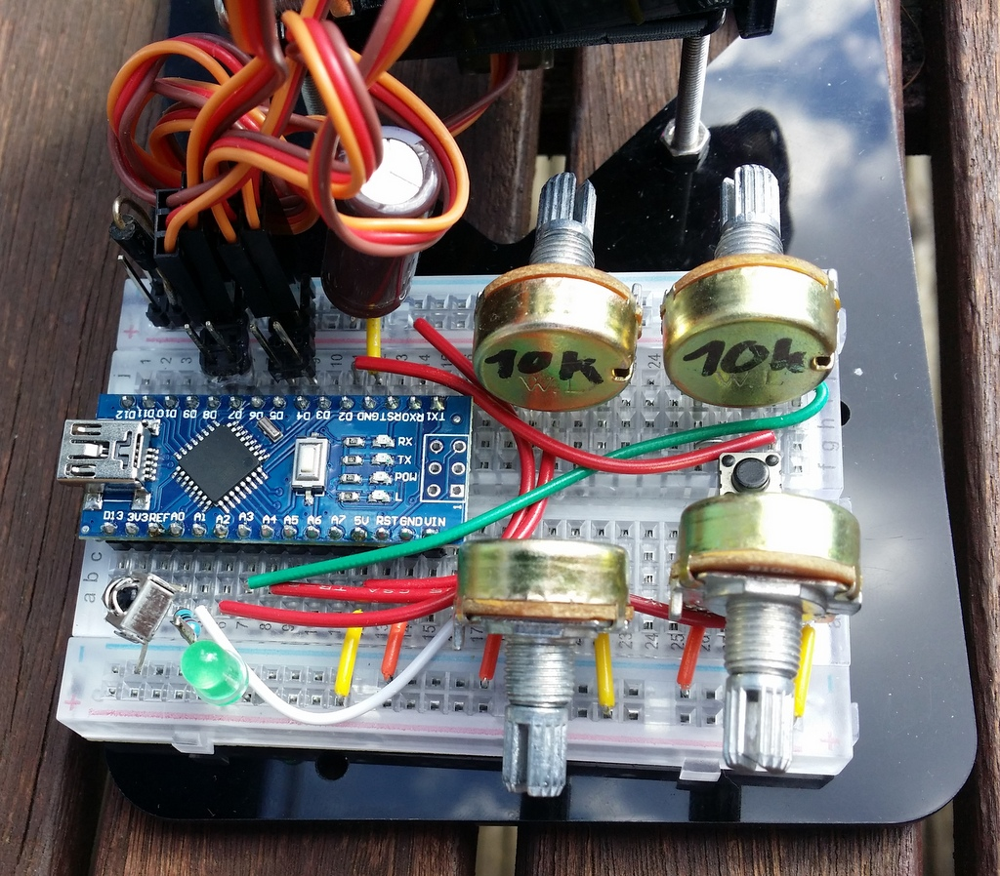

# RobotArmControl a MeArm V0.4 robot control library
Program for controlling a [robot arm with 4 servos](https://www.instructables.com/id/4-DOF-Mechanical-Arm-Robot-Controlled-by-Arduino) using 4 potentiometers and/or an IR Remote.

 &nbsp; &nbsp; 

 &nbsp; &nbsp; 

 &nbsp; &nbsp; 

 &nbsp; &nbsp; 

 
 

Smooth servo movements are controlled by the [Servo easing library for Arduino](https://github.com/ArminJo/ServoEasing). 
Used in the "RobotArmControl" example of Arduino library [ServoEasing](https://github.com/ArminJo/ServoEasing/tree/master/examples/RobotArmControl).

#### If you find this library useful, please give it a star.

&#x1F30E; [Google Translate](https://translate.google.com/translate?sl=en&u=https://github.com/ArminJo/RobotArmControl)

 

| RobotArm | Control board | Instructable |
|-|-|-|
|  |  |  |

 

# Calibration
To calibrate your robot arm, open the Serial Monitor, move the arm manually and change the microsecond values for the `PIVOT_MICROS_AT_*`, `LIFT_MICROS_AT_*`, `HORIZONTAL_MICROS_AT_*` and `CLAW_MICROS_AT_*` positions in *RobotArmServoConfiguration.h*.

The example uses the `EASE_USER_DIRECT` easing type for all servos except the claw to implement **movements by inverse kinematics**.

 

# Compile options / macros for this software
To customize the software to different requirements, there are some compile options / macros available. 
Modify them by enabling / disabling them, or change the values if applicable.

| Name | Default value |Description |
|-|-|-|
| `ROBOT_ARM_HAS_IR_CONTROL` | disabled | IR remote control is enabled. |
| `ROBOT_ARM_HAS_RTC_CONTROL` | disabled | A DS3231 is attached to the control. |

